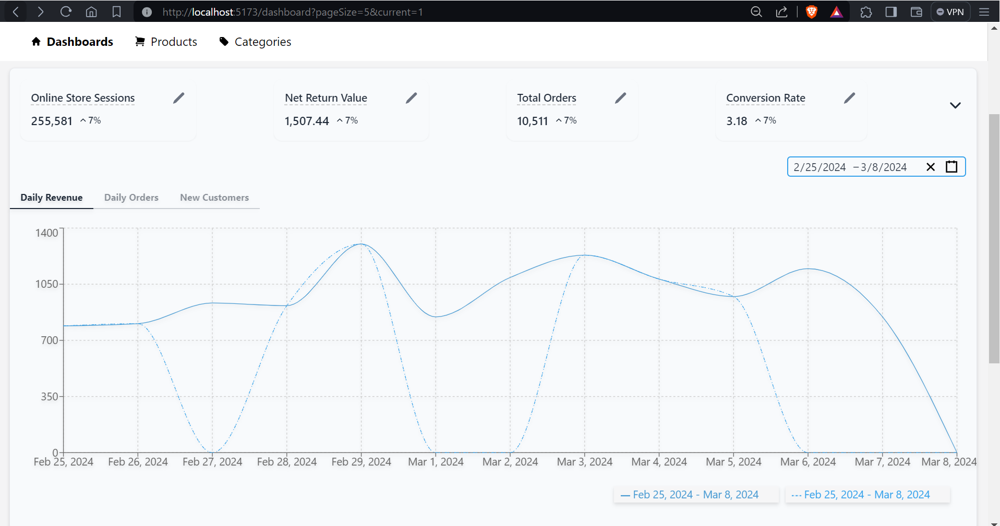
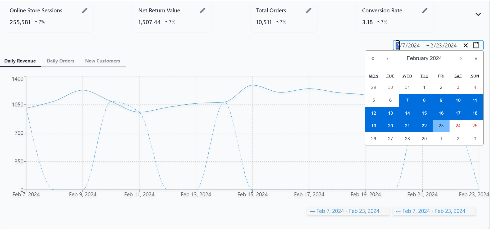

# Marble Refine DaisyUI

This project is created as part of an assignment for Marble AI

## Getting Started

To run the app locally, follow these steps:

1. Clone the repository:

   ```bash
   git clone https://github.com/rayyan016/Marble-refine-daisyui.git
   ```

2. Navigate to the project directory:

   ```bash
   cd Marble-refine-daisyui
   ```

3. Install the dependencies:

   ```bash
   npm install
   ```

4. Start the development server:

   ```bash
   npm run dev
   ```

5. Open your browser and visit `http://localhost:5173` to view the app.


## Approach and Implementation

### Graph Enhancement:

- Added a legend to the graph to display the date range selected.
- Incorporated two lines in the graph as per figma design.
- Added a button to enable folding graph display.

### Date Range Picker Integration:

- Added a date range picker to the graph for selection of a date range to change date range in the graph using a library [wojtekmaj/react-daterange-picker](https://github.com/wojtekmaj/react-daterange-picker).

### Card Component Development:

Created a card component to display the cards above the graph as per the figma design. The card component takes the text to display as a prop.

### List Item Component:

- Upon clicking the pencil icon inside the card component, a list of itm is displayed. The list item component is created to display the list of items.

## Screenshots  



